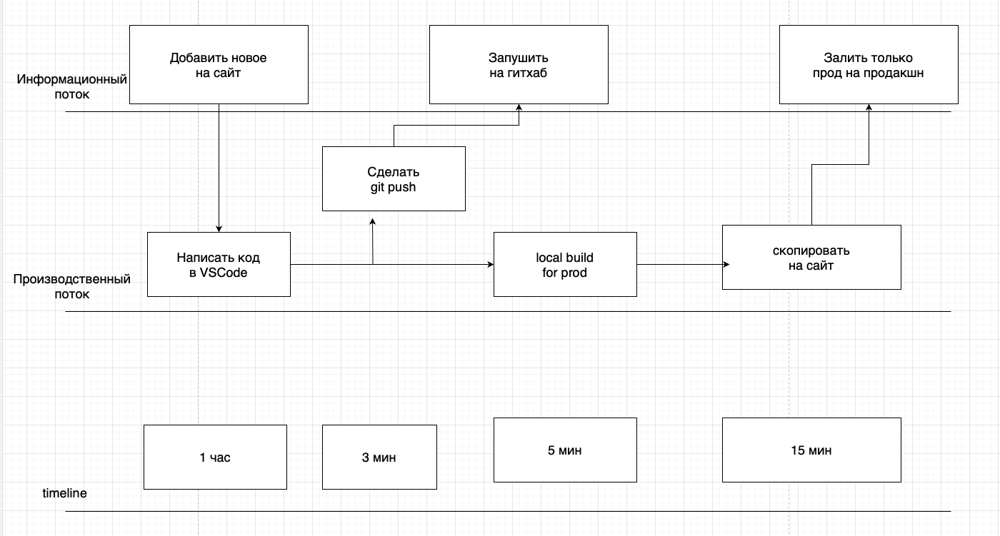
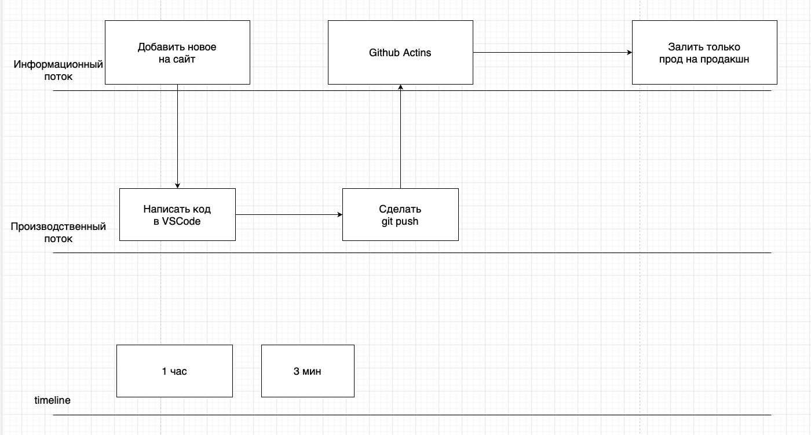

# Урок 4. Lean

Проанализируйте свою повседневную работу или работу отдела в вашей компании на наличие потерь.

Я программирую сайты.

Код пишу в программе VSCode.

Храню код в репозитории гитхаба.

Для готовых сайтов использую хостинг, чтобы все могли видеть их в продакшене.

1. Нарисуйте VSM-карту.

2. Найдите потери и классифицируйте их в соответствии с материалом лекции.

При такой работе есть потери:

- Надо дополнительно на локальной машине собирать продакшен билд.
- Надо через дополнительный софт подключаться к хостингу и копировать туда именно продакшен сборку.

3. Подумайте, как исключить эти потери.

Для автоматизации этой работы я применила Github Action.

- git push запускает pipeline
- в докере подтягивается репозиторий
- запускается установка необходимого ПО для построения продуктового билда
- генерируется продуктовая сборка в отдельной папке
- запускается копирование приватного ключа для доступа на хостинг
- запускается копирование продакшен файлов на хостинг
- закрывается соединение
- удаляется докер

4. Нарисуйте новую VSM-карту в соответствии с вашими предложениями.

Вы можете использовать все рекомендованные на семинаре программы для рисования VSM-карты.
